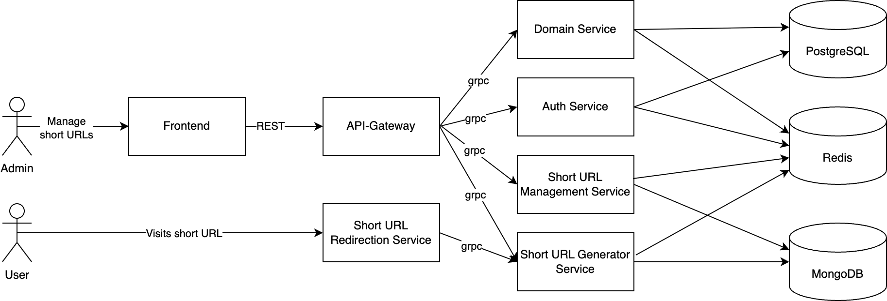

# URL Shortener

A deliberately over-engineered URL shortener service built as a playground for exploring Go, gRPC, and microservice architecture.

## Architecture Overview

This project is a monorepo that contains multiple backend services written in Go. Each service is organized under a single repository to simplify local development, code sharing, and coordination between components.

The architecture follows a modular microservice pattern. Services communicate via gRPC, and a single REST entrypoint is exposed via the API gateway.

### Services Overview



#### `api-gateway`
- **Role:** Public entrypoint for all external requests
- **Responsibilities:**
  - JWT authentication and token validation
  - REST to gRPC translation using **grpc-gateway**
  - Request routing to appropriate backend services
- **Tech stack:**
  - Golang, gRPC, grpc-gateway

#### `auth-service`
- **Role:** Authentication and organization management
- **Responsibilities:**
  - Manage users and organizations
  - Issue and validate JWTs
  - Role-based access control
- **Tech stack:**
  - Golang, gRPC, Redis, PostgreSQL with `sqlc` for type-safe queries

#### `short-url-management-service` and `short-url-generator-service`
- **Role:** Core business logic for creating and resolving short links
- **Responsibilities:**
  - Create new short links (with optional custom slugs)
  - Retrieve long URL by short code
  - Update and delete existing short links
  - Ensure uniqueness (per org, domain, etc.)
- **Tech stack:**
  - Golang, gRPC, MongoDB, Redis

#### `short-url-redirection-service`
- **Role:** Redirection logic for short links
- **Responsibilities:**
  - Redirect short links to their long URLs
  - Track click statistics (in future)
- **Tech stack:**
  - Golang, gRPC

#### `domain-service`
- **Role:** Domains management
- **Responsibilities:**
  - Manage custom domains for organizations (in future)
  - Validate domain ownership
- **Tech stack:**
  - Golang, gRPC

#### `frontend`
- **Role:** User interface for the URL shortener
- **Tech stack:**
  -  React, TypeScript, Tailwind CSS, Shadcn UI, Vite


## 🚀 Getting Started

### Prerequisites

- Go 1.23.2+
- Docker & Docker Compose
- [buf](https://docs.buf.build/) for managing protobufs
- [Task](https://taskfile.dev/) — for running predefined development tasks
- [golangci-lint](https://golangci-lint.run/) — for linting
- [sqlc](https://docs.sqlc.dev/) — for generating type-safe Go code from SQL

### Clone the repo

```bash
git clone https://github.com/FreibergVlad/url-shortener.git
cd url-shortener
```

### Run all services with Docker Compose

```bash
task run
```